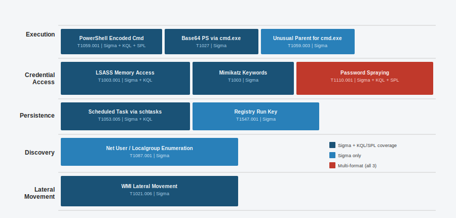

# Detection Rules

A collection of detection rules I have written as part of my homelab detection engineering work. Rules are written in Sigma (universal format), KQL (Microsoft Sentinel), and SPL (Splunk). Each rule includes context on what it detects, which ATT&CK technique it covers, false positives to consider, and how I would triage an alert from it.

Related project: [homelab-detection](https://github.com/NourKhalil0/homelab-detection)

## Rule Coverage



| # | Rule Name | Format | ATT&CK ID | Technique |
|---|-----------|--------|-----------|-----------|
| 1 | PowerShell Encoded Command | Sigma | T1059.001 | Command and Scripting Interpreter |
| 2 | LSASS Memory Access | Sigma | T1003.001 | OS Credential Dumping |
| 3 | Password Spraying via Failed Logons | Sigma | T1110.001 | Brute Force |
| 4 | Scheduled Task via schtasks.exe | Sigma | T1053.005 | Scheduled Task |
| 5 | Suspicious Registry Run Key | Sigma | T1547.001 | Registry Run Keys |
| 6 | Net User Enumeration | Sigma | T1087.001 | Account Discovery |
| 7 | Base64 PowerShell via cmd.exe | Sigma | T1027 | Obfuscated Files |
| 8 | WMI Lateral Movement | Sigma | T1021.006 | Remote Services WMI |
| 9 | Mimikatz Keyword in CommandLine | Sigma | T1003 | OS Credential Dumping |
| 10 | Unusual Parent for cmd.exe | Sigma | T1059.003 | Windows Command Shell |
| 11 | RDP Brute Force | KQL | T1110.001 | Brute Force |
| 12 | PowerShell Encoded Command | KQL | T1059.001 | Command and Scripting Interpreter |
| 13 | Suspicious Scheduled Task | KQL | T1053.005 | Scheduled Task |
| 14 | LSASS Access | KQL | T1003.001 | OS Credential Dumping |
| 15 | Mass Failed Logons | SPL | T1110.001 | Brute Force |
| 16 | Encoded PowerShell | SPL | T1059.001 | Command and Scripting Interpreter |

## Project Structure

```
detection-rules/
  README.md
  docs/
    coverage.svg        - rule coverage diagram
    triage-guide.md     - triage notes per rule
  rules/
    sigma/              - 10 Sigma rules
    kql/                - 4 KQL queries (Microsoft Sentinel)
    spl/                - 2 SPL queries (Splunk)
```

## How to Use the Sigma Rules

Convert to your SIEM format using sigma-cli:

```bash
sigma convert -t splunk rules/sigma/
sigma convert -t microsoft365defender rules/sigma/
sigma convert -t es-qs rules/sigma/
```

## Triage Workflow

Not every alert needs the same treatment. For each one I look at:

1. Process tree - what launched this? Parent process context changes everything.
2. User account - is this account supposed to do this kind of thing?
3. Timing - 2am on a weekend is different from 10am on a Tuesday.
4. Related alerts - lone alert vs. pattern of alerts on same host/user.
5. Decision: escalate, close with note, or keep watching for more.

Full triage notes in [docs/triage-guide.md](docs/triage-guide.md).

## Tools

- Sigma - https://github.com/SigmaHQ/sigma
- sigma-cli - https://github.com/SigmaHQ/sigma-cli
- MITRE ATT&CK - https://attack.mitre.org
- Microsoft Sentinel - https://learn.microsoft.com/en-us/azure/sentinel
- Wazuh - https://wazuh.com
